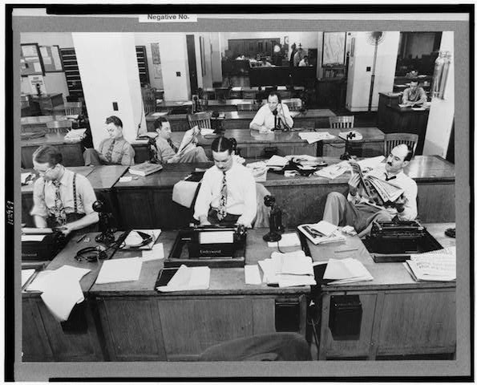

# Ruby for Journalism
## Steel City Ruby 2014
### Derek Willis, The New York Times

#### Who We Are



* Journalists
* Wide range of skills/jobs

#### What We Do

* Events ([elections](http://elections.nytimes.com/2014/results/primaries/live), [Oscars](http://oscars.nytimes.com/2014/ballot/9kca0m1j), [Olympics](http://sochi2014.nytimes.com/results))
* [Breaking](http://projects.nytimes.com/clinton-schedules) [news](https://github.com/NYTimes/Fech)
* [Big](https://projects.propublica.org/treatment/) [projects](http://projects.nytimes.com/toxic-waters/polluters/pennsylvania)

#### Where We Do It

```ruby
['Accuracy', 'Speed', 'Code Quality'].first(2)
```

* In the newsroom, with ridiculous deadlines/circumstances
* [In](https://github.com/documentcloud) [the](https://github.com/propublica) [open](https://github.com/NYTimes)

#### Why We Do It

* [Interesting](http://laurenrabaino.com/2014/07/why-develop-in-the-newsroom/) and constantly-changing problems
* [It matters to people](http://ryantmark.tumblr.com/post/92156514574/why-i-build-for-news)

#### What You Can Do

* Contribute code
* [Learn more about](http://www.ire.org/nicar/) [what we do](http://forjournalism.com/)
* Mozilla fellowships ([deadline Aug. 16!](http://opennews.org/fellowships/apply.html))
* Ditch your current job